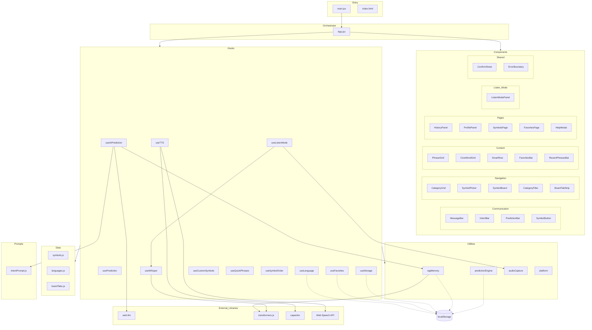
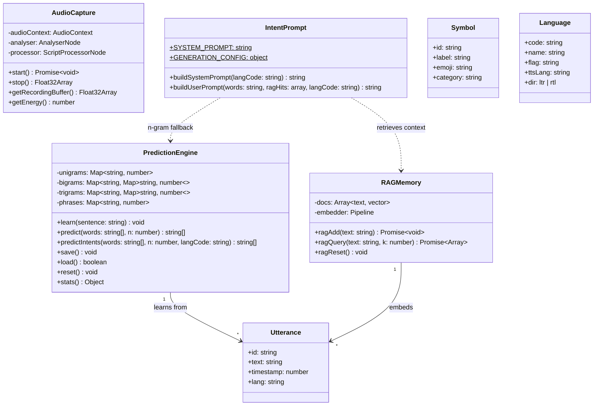
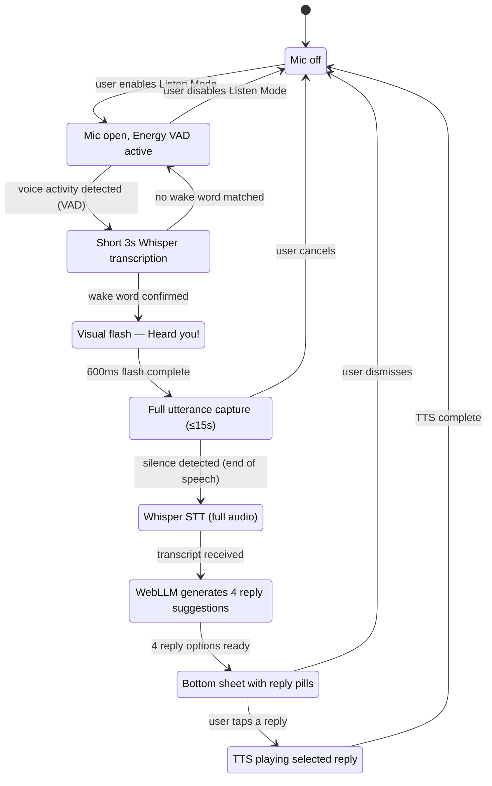
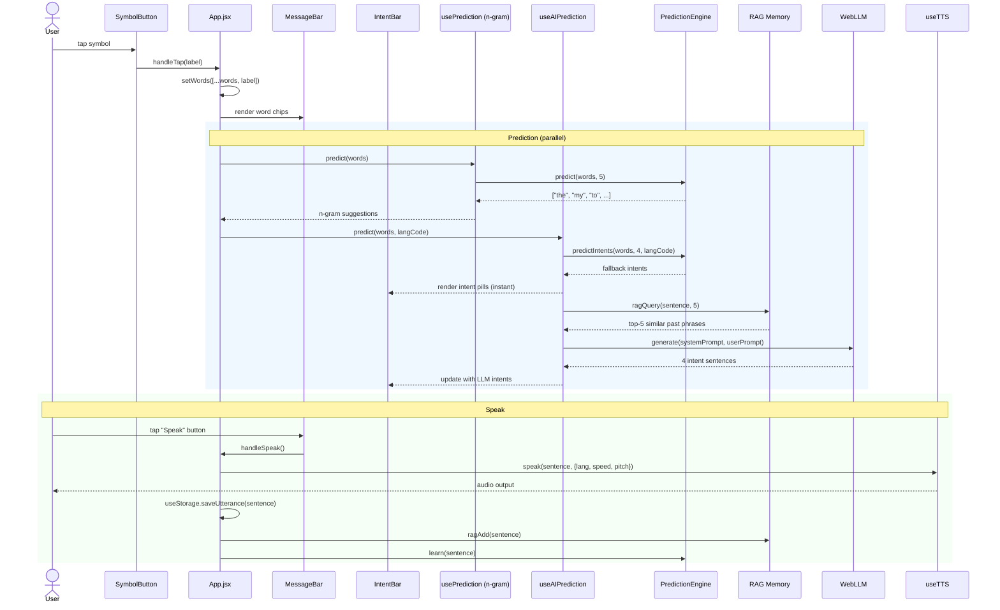
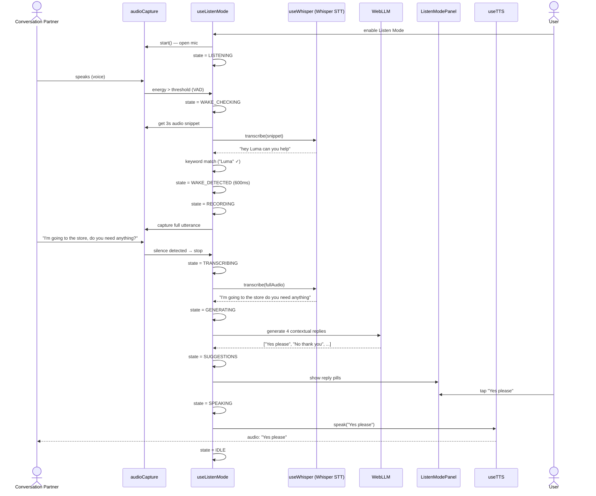
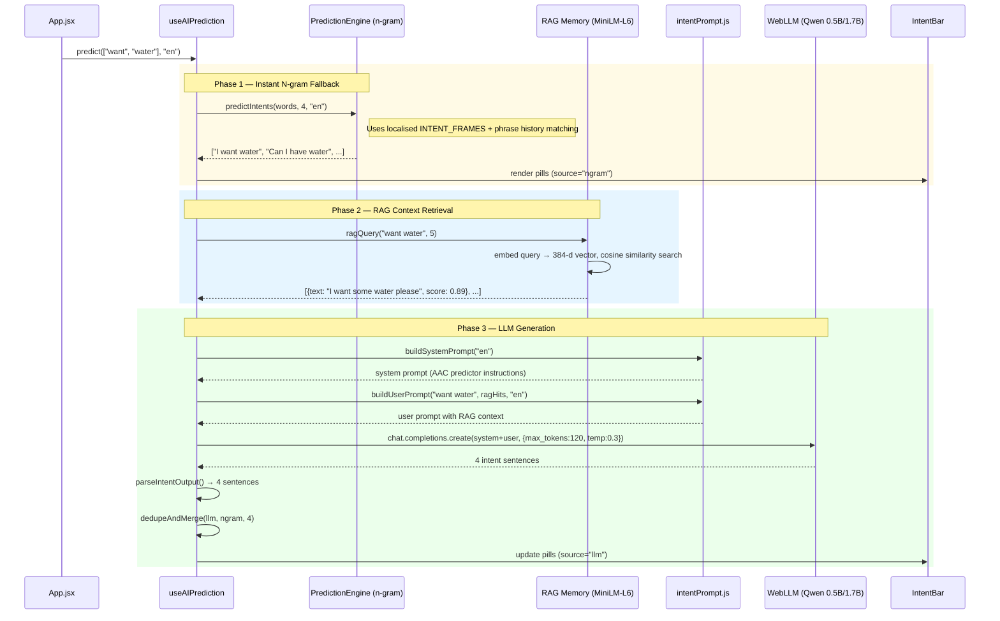
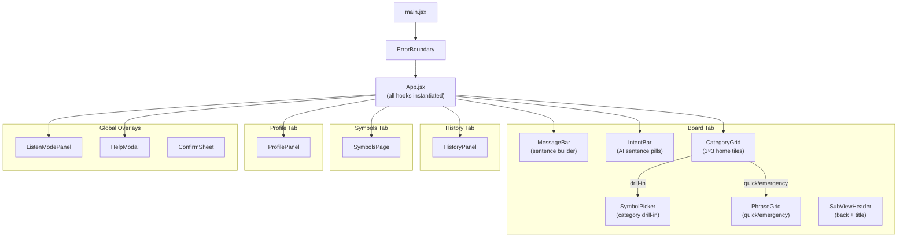
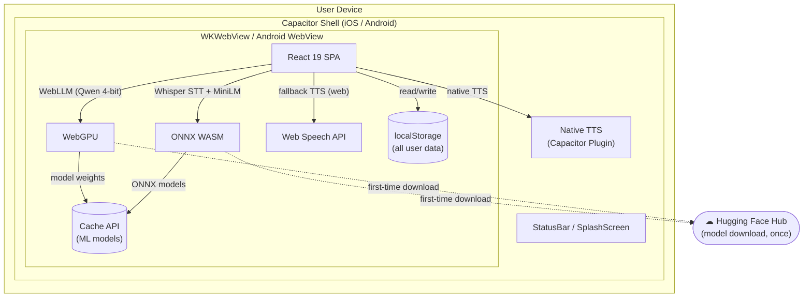
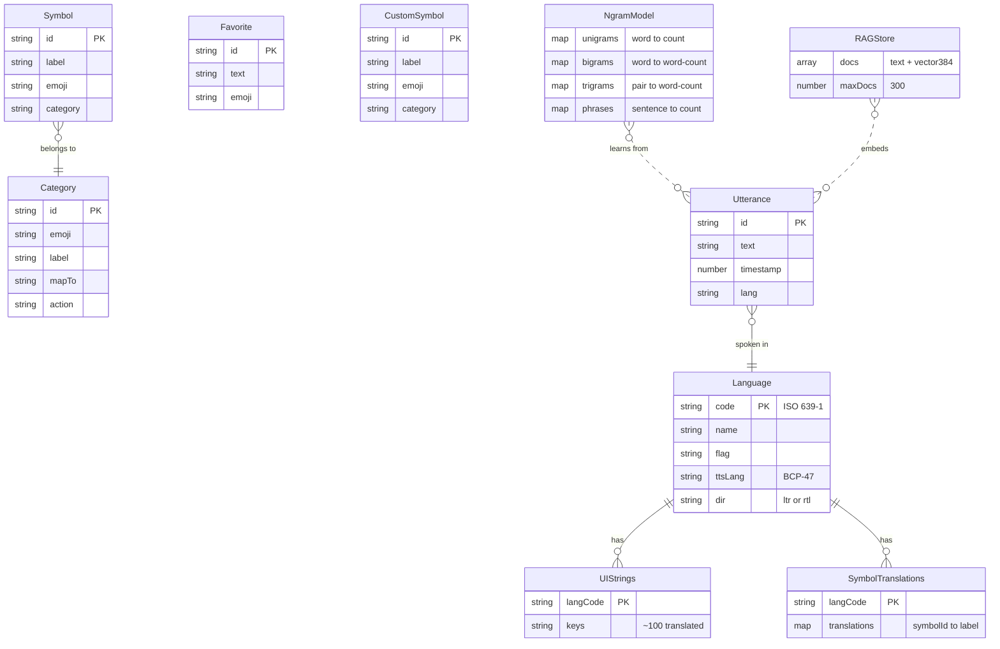

# SpeakEasy AAC — Architecture Document

> **Version:** 2.0  
> **Date:** 9 March 2026  
> **Stack:** React 19 · Vite 7 · Capacitor 8 · WebLLM · Transformers.js

---

## 1. System Overview

SpeakEasy is an Augmentative and Alternative Communication (AAC) app designed
for people with speech disabilities. It runs entirely on-device — no cloud
services required — using on-device AI for intent prediction, speech-to-text,
and RAG-based personalisation.

---

## 2. Technology Stack

| Layer              | Technology                                                 |
| ------------------ | ---------------------------------------------------------- |
| UI Framework       | React 19 + Vite 7                                          |
| Native Shell       | Capacitor 8 (iOS + Android)                                |
| On-device LLM      | @mlc-ai/web-llm (Qwen3-1.7B / Qwen2.5-0.5B, 4-bit, WebGPU) |
| On-device STT       | @xenova/transformers (Whisper tiny/base, ONNX WASM)       |
| RAG Embeddings     | @xenova/transformers (MiniLM-L6-v2, 384-d vectors)         |
| TTS                | @capacitor-community/text-to-speech / Web Speech API        |
| Icons              | lucide-react                                                |
| State Persistence  | localStorage                                                |
| Internationalisation | 10 languages (en, es, fr, de, it, pt, ar, zh, ja, ko)    |

---

## 3. Package Diagram



---

## 4. Component Diagram

```mermaid
graph TB
    App["App.jsx<br/>(Orchestrator)"]:::orchestrator

    subgraph Board_Tab["Board Tab"]
        MB["MessageBar"]
        IB["IntentBar"]
        CG["CategoryGrid<br/>(3×3 Home)"]
        SP["SymbolPicker<br/>(Category Drill)"]
        PG["PhraseGrid<br/>(Quick/Emergency)"]
    end

    subgraph Other_Tabs["Other Tabs"]
        HP["HistoryPanel"]
        SYM["SymbolsPage"]
        PP["ProfilePanel"]
    end

    subgraph Overlays
        LMP["ListenModePanel"]
        HM["HelpModal"]
        CS["ConfirmSheet"]
    end

    subgraph Hooks_Layer["Hooks Layer"]
        hTTS["useTTS"]
        hPred["usePrediction"]
        hAI["useAIPrediction"]
        hStore["useStorage"]
        hLang["useLanguage"]
        hListen["useListenMode"]
        hWhisp["useWhisper"]
        hFav["useFavorites"]
        hCSym["useCustomSymbols"]
        hQP["useQuickPhrases"]
    end

    subgraph AI_ML["AI / ML Layer"]
        PE["PredictionEngine<br/>(n-gram)"]
        RAG["RAG Memory<br/>(MiniLM-L6)"]
        LLM["WebLLM<br/>(Qwen 0.5B/1.7B)"]
        WH["Whisper<br/>(ONNX WASM)"]
        IP["Intent Prompt<br/>(System + User)"]
    end

    subgraph Data_Layer["Data Layer"]
        DSym["symbols.js"]
        DLang["languages.js"]
        DTab["boardTabs.js"]
        LS[(localStorage)]
    end

    App --> MB & IB & CG & SP & PG
    App --> HP & SYM & PP
    App --> LMP & HM

    App --> hTTS & hPred & hAI & hStore & hLang & hListen & hFav & hCSym & hQP

    hAI --> PE & RAG & LLM & IP
    hPred --> PE
    hListen --> hWhisp
    hWhisp --> WH

    hStore & hFav & hLang --> LS
    PE & RAG --> LS

    SP --> DSym & DLang
    hLang --> DLang
    hQP --> DTab

    classDef orchestrator fill:#add8e6,stroke:#333
```



---

## 5. Class Diagram — Core Domain



---

## 6. State Machine — Listen Mode



---

## 7. Sequence Diagram — Symbol Tap → Speak



---

## 8. Sequence Diagram — Listen Mode Conversation



---

## 9. Sequence Diagram — AI Intent Prediction Pipeline



---

## 10. Component Tree (Hierarchy)



---

## 11. Deployment Diagram



---

## 12. Data Model



---

## 13. localStorage Keys

| Key                              | Owner             | Content                                  |
| -------------------------------- | ----------------- | ---------------------------------------- |
| `speakeasy_history_v1`           | useStorage        | Utterance history (JSON array)           |
| `speakeasy_settings_v1`         | useStorage        | User preferences (JSON object)           |
| `speakeasy_ngrams_v1`           | PredictionEngine  | N-gram frequency tables                  |
| `speakeasy_rag_v1`              | ragMemory         | 384-d vectors + text (max 300 docs)      |
| `speakeasy_favorites_v1`        | useFavorites      | Favourite phrases (JSON array)           |
| `speakeasy_custom_symbols_v1`   | useCustomSymbols  | User-created symbols                     |
| `speakeasy_hidden_symbols_v1`   | useCustomSymbols  | Hidden built-in symbol IDs               |
| `speakeasy_quick_phrases_v1`    | useQuickPhrases   | Customised phrase tabs                   |
| `speakeasy_symbol_order_v1`     | useSymbolOrder    | Per-category symbol ordering             |
| `speakeasy_uilang_v1`           | useLanguage       | Interface language code                  |
| `speakeasy_typelang_v1`         | useLanguage       | Symbol board language code               |
| `speakeasy_ttslang_v1`          | useLanguage       | TTS voice language code                  |
| `speakeasy_listenlang_v1`       | useLanguage       | Speech recognition language code         |
| `speakeasy_langs_linked_v1`     | useLanguage       | Whether type↔TTS are linked              |
| `speakeasy_name_v1`             | ProfilePanel      | User's display name                      |
| `speakeasy_avatar_v1`           | ProfilePanel      | User's avatar selection                  |
| `speakeasy_theme_v1`            | App.jsx           | Light / dark theme preference            |

---

## 14. File Map

```
speakeasy/
├── index.html                     # Entry HTML (Capacitor viewport-fit)
├── vite.config.js                 # Vite config (COOP/COEP, WASM, chunking)
├── package.json                   # Dependencies & scripts
├── public/                        # Static assets
├── src/
│   ├── main.jsx                   # React root mount + ErrorBoundary
│   ├── App.jsx                    # Root orchestrator (644 lines)
│   ├── App.css                    # App-specific styles
│   ├── index.css                  # Global theme (light/dark, CSS vars)
│   ├── components/
│   │   ├── MessageBar.jsx         # Sentence builder + speak button
│   │   ├── IntentBar.jsx          # AI intent pills (tap=speak, hold=edit)
│   │   ├── CategoryGrid.jsx       # 3×3 home category tiles
│   │   ├── SymbolPicker.jsx       # Category drill-in symbol grid
│   │   ├── SymbolBoard.jsx        # Scrollable symbol grid
│   │   ├── SymbolButton.jsx       # Single AAC tile (emoji + label)
│   │   ├── CoreWordGrid.jsx       # High-frequency core words
│   │   ├── SmartRow.jsx           # Context-aware cross-category row
│   │   ├── PredictionBar.jsx      # N-gram next-word strip
│   │   ├── PhraseGrid.jsx         # Quick reply / emergency phrases
│   │   ├── CategoryFilter.jsx     # Category selector + display mode
│   │   ├── BoardTabStrip.jsx      # Board sub-tab strip
│   │   ├── FavoritesBar.jsx       # Inline favourite pills
│   │   ├── FavoritesPage.jsx      # Favourites management page
│   │   ├── RecentPhrasesBar.jsx   # Recent phrases strip
│   │   ├── HistoryPanel.jsx       # Utterance history list
│   │   ├── ProfilePanel.jsx       # Settings (858 lines, iOS-style)
│   │   ├── SymbolsPage.jsx        # Symbol management (add/hide)
│   │   ├── ListenModePanel.jsx    # Listen Mode overlay (state-driven)
│   │   ├── HelpModal.jsx          # Help sheet + contact form
│   │   ├── ConfirmSheet.jsx       # Reusable confirmation dialog
│   │   └── ErrorBoundary.jsx      # React error boundary
│   ├── hooks/
│   │   ├── useTTS.js              # Text-to-speech (native + web)
│   │   ├── usePrediction.js       # N-gram prediction React wrapper
│   │   ├── useAIPrediction.js     # WebLLM intent prediction
│   │   ├── useWhisper.js          # Whisper STT (ONNX WASM)
│   │   ├── useListenMode.js       # Listen Mode state machine
│   │   ├── useStorage.js          # History + settings persistence
│   │   ├── useLanguage.js         # 4-dimension language management
│   │   ├── useFavorites.js        # Favourite phrases CRUD
│   │   ├── useCustomSymbols.js    # Custom symbol management
│   │   ├── useQuickPhrases.js     # Quick phrase tab customisation
│   │   └── useSymbolOrder.js      # Per-category symbol ordering
│   ├── utils/
│   │   ├── predictionEngine.js    # N-gram engine (bi/trigram + phrases)
│   │   ├── ragMemory.js           # RAG vector store (MiniLM-L6)
│   │   ├── audioCapture.js        # Web Audio mic + VAD
│   │   └── platform.js            # Capacitor platform detection
│   ├── data/
│   │   ├── symbols.js             # AAC symbol definitions (9 categories)
│   │   ├── languages.js           # 10 languages + translations + UI strings
│   │   └── boardTabs.js           # Board tabs + default phrases
│   └── prompts/
│       └── intentPrompt.js        # LLM system/user prompt templates
└── docs/
    └── ARCHITECTURE.md            # This file
```

---

## 15. Design Decisions

| Decision | Rationale |
| --- | --- |
| **No Redux / Context API** | App.jsx is the single orchestrator; prop-drilling is sufficient for the flat component tree |
| **All AI on-device** | Privacy-first by design — no audio or text ever leaves the device |
| **4-bit quantised models** | Enables running LLMs in the browser; Qwen3 1.7B fits in ~900 MB VRAM |
| **N-gram + LLM dual path** | N-grams provide instant fallback (<1ms); LLM enhances when loaded |
| **RAG over utterance history** | Personalises suggestions based on the user's actual communication patterns |
| **localStorage only** | Works identically in browser and Capacitor WebView; no native DB needed |
| **CSS custom properties for theming** | `data-theme` attribute enables instant light/dark switching without re-render |
| **Separated language dimensions** | UI, symbols, TTS, and listen can theoretically differ (e.g. bilingual user) |
| **Energy VAD + wake word** | Two-stage listening avoids continuous Whisper transcription (saves battery) |
